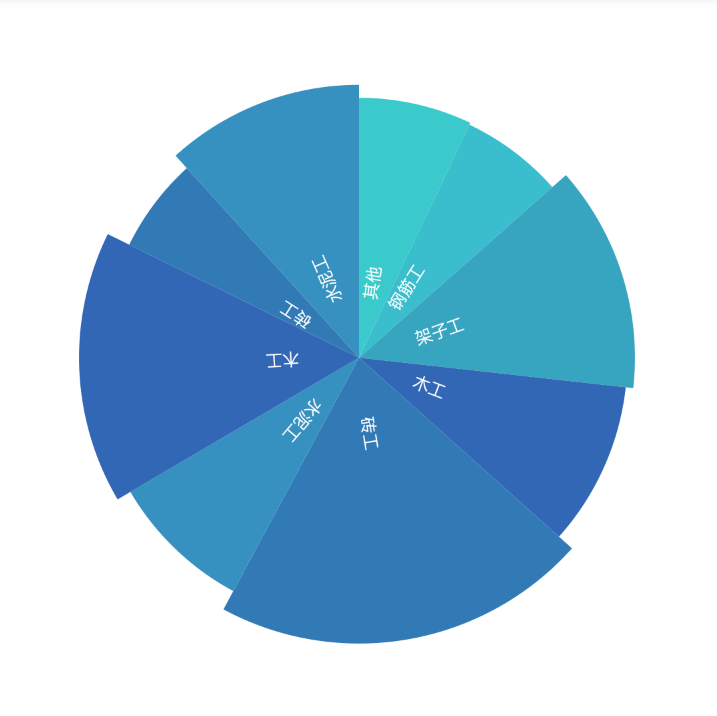

# FanBladeView
扇叶饼图统计、半径偏移、扇形内部文字
# 预览

# 资源
|名字|资源|
|-|-|
|AAR|[fan_blade_view.aar](https://github.com/RelinRan/FanBladeView/blob/master/fan_blade_view_2022.7.22.1.aar)|
|GitHub |[FanBladeView](https://github.com/RelinRan/FanBladeView)|
|Gitee|[FanBladeView](https://gitee.com/relin/FanBladeView)|
# Maven
1.build.grade | setting.grade
```
repositories {
	...
	maven { url 'https://jitpack.io' }
}
```
2./app/build.grade
```
dependencies {
	implementation 'com.github.RelinRan:FanBladeView:2022.7.22.1'
}
```
# xml
~~~
<androidx.widget.FanBladeView
    android:id="@+id/fan_blade"
    android:layout_width="match_parent"
    android:layout_height="wrap_content"
    android:padding="20dp"
    app:radiusExponent="10"
    app:fanTextSize="12sp"
    app:fanTextHorizontalOffset="50dp"
    app:radiusOffset="20dp" />
~~~
# attrs.xml
~~~
<!--文字水平偏移量-->
<attr name="fanTextHorizontalOffset" format="dimension" />
<!--文字大小-->
<attr name="fanTextSize" format="dimension" />
<!--半径偏移量-->
<attr name="radiusOffset" format="dimension" />
<!--半径幂指数-->
<attr name="radiusExponent" format="integer" />
~~~
# 使用
~~~
FanBladeView fan_blade = findViewById(R.id.fan_blade);
List<Fan> data = new ArrayList<>();
data.add(new Fan("其他", 120, Color.parseColor("#3ACACC")));
data.add(new Fan("钢筋工", 110, Color.parseColor("#3ABDCC")));
data.add(new Fan("架子工", 226, Color.parseColor("#37A5C0")));
data.add(new Fan("木工", 168, Color.parseColor("#3267B6")));
data.add(new Fan("砖工", 362, Color.parseColor("#327AB6")));
data.add(new Fan("水泥工", 148, Color.parseColor("#3791C0")));
data.add(new Fan("木工", 268, Color.parseColor("#3267B6")));
data.add(new Fan("砖工", 102, Color.parseColor("#327AB6")));
data.add(new Fan("水泥工", 200, Color.parseColor("#3791C0")));
fan_blade.setDatasource(data);
~~~
